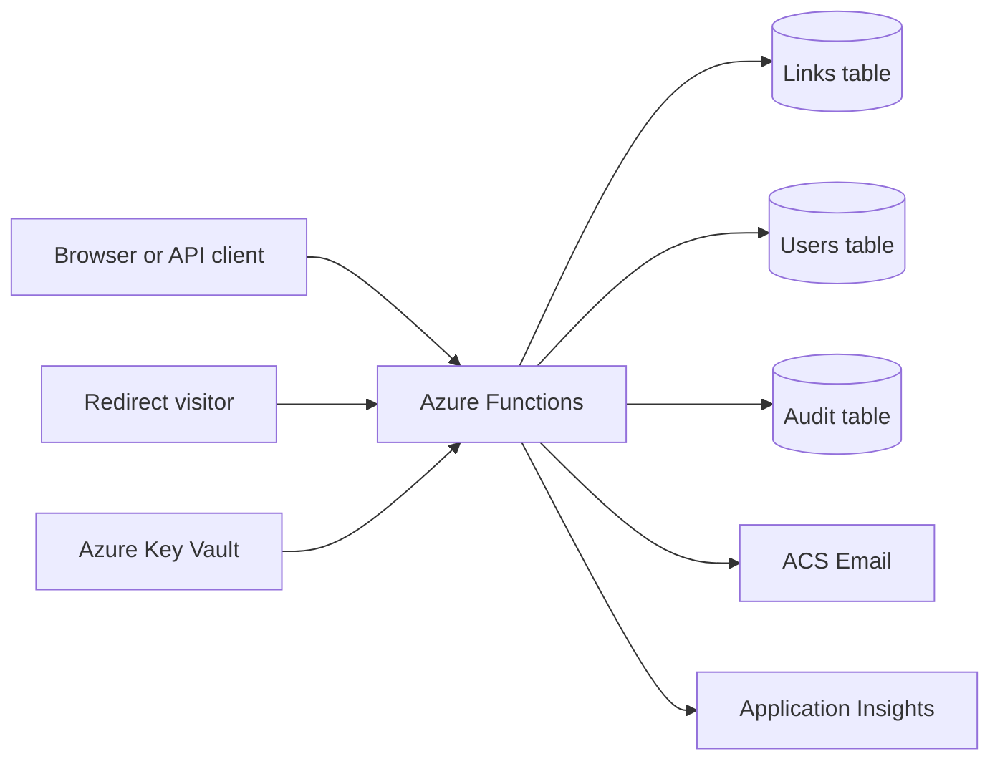

# AzShortLink

AzShortLink is a self-hosted URL shortener built on Azure Functions. It combines public redirects with authenticated link management, QR downloads, visual analytics, local multi-user identity, invitation controls, audit logging, and infrastructure as code.

## Documentation

| Document | Purpose |
|---|---|
| [Deployment guide](docs/DEPLOY.md) | Provision Azure resources, configure email and domains, deploy, rotate secrets, and troubleshoot |
| [Architecture](docs/ARCHITECTURE.md) | Runtime flows, storage model, authentication, invitation trust chain, and security boundaries |
| [Solution blog](docs/BLOG.md) | Long-form story covering design decisions, tradeoffs, and lessons |
| [`/api`](https://azhk.in/api) | Interactive, branded Swagger UI |
| [`/openapi.json`](https://azhk.in/openapi.json) | OpenAPI 3.0 document |

## Capabilities

### Link management

- Create random or custom short links.
- Redirect visitors while recording aggregate usage statistics.
- List and delete links within profile ownership boundaries.
- Download a 512 px PNG QR code at creation time or later from the link list.
- Keep aliases globally unique within one deployment.

### Identity and access

- Local `user` and `admin` roles without an external identity-provider dependency.
- bcrypt passwords and signed, HTTP-only session cookies.
- Optional WebAuthn passkeys with locally stored public-key credentials.
- Personal API keys stored as SHA-256 hashes and shown only once.
- Multiple administrators with protection against demoting the final administrator.

### Controlled invitations

- Single-use invites with direct sponsor, root sponsor, and depth tracking.
- Email verification through Azure Communication Services Email.
- Non-enumerating self-service password reset using queued, signed, one-time links that expire after 30 minutes.
- Duplicate prevention using a keyed hash of the normalized email address.
- Keyed IP and coarse device signals for review, never as identity proof.
- Non-blocking signup risk flags for administrator review, plus recursive branch suspension.
- Default non-admin eligibility: verified email, plus either account age 3 days or 3 owned links with redirects; depth 3 and 100 descendants per root still apply.

### Operations

- Dashboard views for Links, Statistics, Account, Profiles, Invites, Operations, and Audit trail.
- Visual statistics for utilization, links, browsers, operating systems, devices, referrers, countries, approximate click locations, and owners.
- Aggregate statistics across accessible links or filter the dashboard and API to one short link.
- Thirty-day SIEM-oriented security audit log with explicit signup success/failure events, bounded anonymous telemetry, actor, channel, authentication, request, user-agent, source geography, outcome, filters, and CSV export.
- Health endpoint and configurable process-local API throttling.
- Styled Swagger UI and a complete OpenAPI 3.0 specification.

## Architecture



The data classes use separate Azure Tables. The Function App has a system-assigned managed identity and resolves secrets through versionless Key Vault references. See [Architecture](docs/ARCHITECTURE.md) for detailed flows.

## Access Model

| Capability | User | Administrator |
|---|---:|---:|
| Manage owned links and QR codes | Yes | Yes |
| View owned analytics | Yes | Yes |
| View all links and owner analytics | No | Yes |
| Create an invite | Policy-controlled, one total | Yes |
| Manage profiles, roles, approval, and branches | No | Yes |
| Manage all invitations | No | Yes |
| Query the audit trail | No | Yes |

Protected operations reload the profile's current role and status. Demotion, suspension, or branch suspension therefore takes effect without waiting for an old session to expire.

## API Access

Open `https://<your-host>/api`, select **Authorize**, and provide either:

- `ApiKeyHeader`: a personal or deployment-wide key; or
- `BearerAuth`: the same key as a bearer token.

A user key is profile-scoped. An administrator key can use management endpoints. Session-only profile and passkey operations use the dashboard cookie when Swagger runs on the same origin.

```bash
curl -X POST "https://azhk.in/api/shorten" \
  -H "x-api-key: azsl_<personal-key>" \
  -H "content-type: application/json" \
  -d '{"url":"https://learn.microsoft.com/azure/azure-functions/","uniqueValue":"azure-functions"}'
```

| Method | Route | Purpose |
|---|---|---|
| `POST` | `/api/shorten` | Create a short link |
| `GET` | `/{code}` | Public redirect |
| `GET` | `/api/stats/{code?}` | Link statistics |
| `DELETE` | `/api/links/{code}` | Delete a link |
| `GET` | `/api/links/{code}/qr` | Download its QR code |
| `GET` | `/api/analytics` | Aggregate analytics |
| `GET` | `/api/health` | Runtime health |
| `GET` | `/api/audit` | Administrator audit query |

Use OpenAPI for the complete endpoint and schema reference.

Pass `code=<short-code>` to `/api/analytics` to restrict statistics to one accessible link. Geographic analytics use a local IP database during redirect handling. Only aggregate country and approximate city/coordinate counters are stored with each link; redirect visitor IP addresses are not retained.

## Local Development

Requirements: Node.js 22+, Azure Functions Core Tools v4, and Azurite or an accessible Azure Storage account.

```bash
npm ci
cp local.settings.sample.json local.settings.json
read -rsp 'Local dashboard password: ' LOCAL_PASSWORD
echo
export DASHBOARD_PASSWORD_HASH="$(node scripts/generate-dashboard-hash.js "$LOCAL_PASSWORD")"
unset LOCAL_PASSWORD
```

Add `DASHBOARD_USERNAME`, the generated `DASHBOARD_PASSWORD_HASH`, `DASHBOARD_SESSION_SECRET`, and `IDENTITY_HASH_SECRET` to `local.settings.json`. Configure ACS settings when testing invite email.

```bash
func start
```

- Dashboard: `http://localhost:7071/dashboard`
- Swagger: `http://localhost:7071/api`
- Health: `http://localhost:7071/api/health`

The application layer can use in-memory storage for tests. Azure deployments use the Function managed identity for host and Table Storage access; local development still uses Azurite through `AzureWebJobsStorage`.

## Configuration

| Setting | Production | Sensitive | Purpose |
|---|---:|---:|---|
| `SHORTLINK_API_KEY` | Required | Yes | Deployment administrator API key |
| `PUBLIC_BASE_URL` | Required | No | Canonical links and WebAuthn origin |
| `AzureWebJobsStorage` / `AZURE_STORAGE_CONNECTION_STRING` | Local only | Yes | Azurite host and tables |
| `AZURE_STORAGE_TABLE_ENDPOINT` | Azure deployment | No | Managed-identity Table endpoint |
| `AZURE_STORAGE_QUEUE_ENDPOINT` | Azure deployment | No | Managed-identity password-reset queue endpoint |
| `SHORTLINK_TABLE_NAME` | Optional | No | Links table |
| `SHORTLINK_USERS_TABLE_NAME` | Optional | No | Profiles and credentials table |
| `SHORTLINK_AUDIT_TABLE_NAME` | Optional | No | Audit table |
| `DASHBOARD_USERNAME` | Required | No | Bootstrap administrator |
| `DASHBOARD_PASSWORD_HASH` | Required | Yes | Bootstrap bcrypt hash |
| `DASHBOARD_SESSION_SECRET` | Required | Yes | Independent session and challenge signing key |
| `IDENTITY_HASH_SECRET` | Required | Yes | Keyed identity and risk hashes |
| `COMMUNICATION_SERVICES_CONNECTION_STRING` | For invite signup | Yes | Verification delivery |
| `EMAIL_SENDER_ADDRESS` | For invite signup | No | Verified ACS sender |
| `API_RATE_LIMIT_MAX_REQUESTS` | Optional | No | Requests per shared storage-backed window for anonymous and Free-plan callers, default `60` |
| `API_RATE_LIMIT_WINDOW_MS` | Optional | No | Window length, default `60000` |
| `EMAIL_DOMAIN_BLOCKLIST` | Optional | No | Extra domains rejected at signup, in addition to the bundled disposable-provider list |
| `EMAIL_DOMAIN_ALLOWLIST` | Optional | No | When set, only these domains may register; takes precedence over the blocklist |

## Plans and Quotas

Every account is on a plan that caps daily volume, because each redirect is a Function invocation plus a table write.

| Plan | Price | New links / day | Redirects / day | API requests / minute |
|---|---:|---:|---:|---:|
| Free | &euro;0 | 25 | 1,000 | 60 |
| Pro | &euro;9 | 250 | 25,000 | 600 |
| Business | &euro;49 | 2,000 | 250,000 | 3,000 |

Counters reset at 00:00 UTC and exceeded limits return HTTP 429; links are never removed. `/pricing` lists the plans, `GET /api/account/plan` reports the current limits and usage, and `POST /api/account/plan` records an upgrade request. Paid plans are activated by an administrator with `PATCH /api/users/{username}/plan` once payment is confirmed; an optional `expiresAt` makes the account fall back to Free automatically. No payment provider is wired in.

Disposable and temporary mailbox providers are rejected at signup from a bundled domain list. Sub-addressed and dotted variants of the same mailbox are canonicalized before the duplicate check, so one inbox cannot register repeatedly.

Bicep writes sensitive values to Key Vault and configures versionless App Service references. Local development reads the same setting names directly.

## Repository Layout

```text
index.js                    HTTP route registration
src/api/                    OpenAPI document construction
src/analytics/              user-agent and geographic analytics
src/assets/css/             page, dashboard, and deployment styles
src/assets/images/          locally served visual assets
src/auth/                   sessions, identity, passkeys, and invite policy
src/core/                   configuration, auditing, plans, and rate limiting
src/pages/                  login, signup, error, and Swagger templates
src/services/               short links, email, and QR code services
src/storage/                storage adapters
src/dashboard/              dashboard UI
infra/                      Bicep infrastructure
test/                       Node test suite
docs/                       project documentation
```

## Testing

```bash
npm test
```

The Node test suite covers domain behavior, storage, authentication, rate limiting, dashboards, identity controls, passkeys, OpenAPI, QR generation, and audit retention.

## Deployment

Bicep provisions the Function App, Basic B1 plan, Storage Account and tables, Application Insights, Key Vault, managed identity access, and optional custom-domain certificates. ACS Email must already exist with a verified sender.

Follow the [deployment guide](docs/DEPLOY.md). GitHub Actions tests on Node 22 and deploys application code using Azure OIDC.

## Current Boundaries

- One deployment has one canonical `PUBLIC_BASE_URL`; native multi-domain tenancy is not implemented.
- Rate limiting is process-local. Use Front Door, API Management, or a WAF for deployment-wide quotas.
- Risk signals support review but do not prove one account per human.
- Email verification proves mailbox control, not legal identity.
- Audit retention is 30 days and cleanup is opportunistic on writes.

## License

See [LICENSE](LICENSE).
