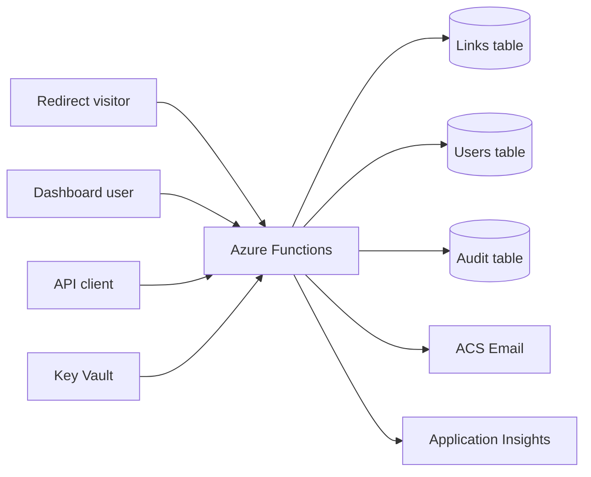
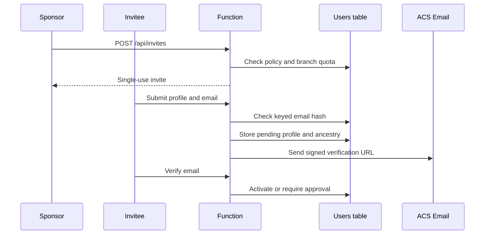

# AzShortLink Architecture

## Goals

AzShortLink keeps a small operational footprint while preserving ownership and security boundaries. It must redirect quickly, support multiple local profiles, expose automation, provide aggregate analytics, and retain enough invitation provenance to investigate abuse without claiming full KYC.

## System Context



The application is one Node.js 22 Functions worker using the v4 programming model. `index.js` registers routes; services and storage adapters own domain and persistence behavior.

## Azure Resources

| Resource | Responsibility |
|---|---|
| Function App | Routes, dashboard, authentication, redirects, and API |
| Basic B1 plan | Linux host and custom-domain SSL support |
| Storage Account | Function host storage and Azure Tables |
| Links table | Targets, owners, counters, and agent statistics |
| Users table | Profiles, password hashes, API keys, passkeys, and invites |
| Audit table | Security events and retention queries |
| Key Vault | Storage and application secrets |
| Managed identity | Resolves Key Vault references |
| Application Insights | Runtime observability |
| ACS Email | Signup verification delivery |

## Request Flows

### Create and redirect

```mermaid
sequenceDiagram
    participant Client
    participant Function
    participant Service as ShortLinkService
    participant Links as Links table
    participant Audit as Audit table

    Client->>Function: POST /api/shorten
    Function->>Function: Resolve current identity
    Function->>Service: createShortLink(payload, ownerId)
    Service->>Links: Create globally unique code
    Function->>Audit: LINK_CREATED
    Function-->>Client: 201 short link
    Client->>Function: GET /{code}
    Function->>Service: resolveShortLink(code, metadata)
    Service->>Links: Update aggregate counters
    Function-->>Client: 302 destination
```

Redirect telemetry stores browser, OS, device, referrer, country, and approximate location counters. A bundled local GeoIP database resolves the Azure client IP during redirect handling, coordinates are rounded before storage, and redirect visitor IP addresses are not persisted in link analytics.

### QR download

`GET /api/links/{code}/qr` applies link ownership rules and generates a 512 px PNG from the canonical short URL. The image is derived on demand and is not persisted.

### Invite signup



Plaintext email is transient. Storage retains a masked value and an HMAC hash. Rotating the HMAC secret requires migration.

## Authentication and Authorization

### Password sessions

Passwords use bcrypt. Login creates a signed HTTP-only cookie with an eight-hour lifetime. Protected operations reload current role, status, and branch state, so stale cookie claims cannot preserve removed access.

### Passkeys

WebAuthn is optional. Stored data consists of credential ID, public key, replay counter, transports, backup state, and device type. Five-minute challenge state is signed instead of held only in worker memory.

### API keys

- The deployment key maps to the bootstrap administrator.
- Personal keys use the `azsl_` prefix.
- Only personal-key SHA-256 hashes are stored.
- Keys inherit the owner's current permissions.
- Rotation invalidates the previous key.

### Roles

Users manage owned links and analytics. Administrators manage all links, profiles, roles, approval, branches, invitations, service health, and audit data. The final administrator cannot demote itself.

## Invitation Trust Model

Profiles retain direct sponsor, root sponsor, invitation depth, status, branch suspension, keyed signup signals, and risk flags.

| Control | Default |
|---|---:|
| Minimum account age | 7 days |
| Minimum owned links | 3 |
| Maximum depth | 3 |
| Maximum descendants per root | 100 |
| Non-admin invitations | 1 total |

Shared IP or device signals trigger review, not an identity conclusion. Email verification proves mailbox control, not legal identity. Recursive branch suspension provides containment.

## Storage Model

A common adapter is implemented by `TableStorage`, `InMemoryStorage`, and `UnavailableStorage`.

### Links table

Partition `LINK` stores code, destination, owner, creation time, redirect count, last access time, and aggregate agent statistics.

### Users table

| Partition | Contents |
|---|---|
| `USER` | Profile, password hash, role, status, ancestry, and identity metadata |
| `APIKEY` | API-key hash to owner lookup |
| `PASSKEY` | WebAuthn public credential and counter |
| `INVITE` | Single-use invitation state |

### Audit table

Partition `AUDIT` stores security events. Queries always enforce the 30-day cutoff even before opportunistic deletion removes expired entities.

Separate physical tables reduce accidental cross-disclosure between redirect data, credentials, and audit history.

## Analytics

The model provides totals, utilization, top and recent links, browsers, operating systems, device types, referrers, countries, approximate map locations, and administrator owner breakdowns. Analytics can cover every accessible link or one selected short link. The UI renders cards, a donut, columns, proportional bars, an OpenStreetMap-based marker map, and recent activity.

No time-series chart is shown because storage contains cumulative counters rather than timestamped redirect events.

## Secret Management

Bicep creates an RBAC-enabled Key Vault and grants the Function identity `Key Vault Secrets User`. Versionless references resolve the storage connection, API key, password hash, session secret, identity hash secret, and ACS connection string.

Public URL, sender address, table names, and rate-limit values remain normal settings.

## Security Controls

- HTTPS-only host.
- CSP, frame denial, no-referrer, and MIME-sniffing headers.
- bcrypt passwords and timing-safe comparisons.
- HTTP-only SameSite cookies; Secure on HTTPS.
- WebAuthn user verification.
- Keyed identity and risk hashes.
- Current-state authorization.
- API and login throttles.
- Audit events excluding passwords, tokens, and full API keys.
- Key Vault RBAC, soft delete, and purge protection.

## Failure Behavior

Storage initialization failures use an unavailable adapter so routes still index and return explicit `503` responses. Audit writes are best effort. Health distinguishes links, users, and audit storage.

## Tradeoffs

- Table Storage is inexpensive, but cumulative counters are not an event stream.
- Process-local throttling is not a global quota.
- Local identity avoids an Entra user dependency but makes recovery and abuse policy local responsibilities.
- Risk signals cannot guarantee one account per person.
- One canonical URL means the deployment is not multi-domain tenancy.
- Bicep seeds secrets through secure deployment parameters; stricter environments can bootstrap the vault separately.
