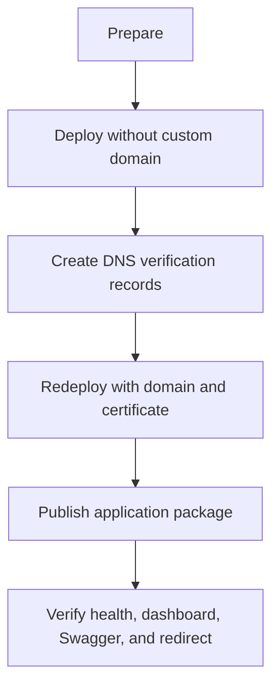

# Deploy AzShortLink to Azure

This runbook provisions Azure infrastructure, configures email and DNS, deploys the Function App, and covers secret rotation and troubleshooting.

## Deployment Flow



## 1. Prerequisites

| Requirement | Notes |
|---|---|
| Azure subscription | Permission to create resources and role assignments |
| Azure CLI 2.60+ | Includes Bicep support |
| Node.js 22+ | Matches runtime and CI |
| Azure Functions Core Tools v4 | Direct publishing |
| Azure Communication Services Email | Invite verification delivery |
| Verified email sender | Used as `EMAIL_SENDER_ADDRESS` |
| DNS provider access | Custom domains only |

```bash
az login
az account set --subscription '<subscription-id>'
SUBSCRIPTION_ID=$(az account show --query id --output tsv)
```

The deploying identity needs `Owner`, or `Contributor` plus `Role Based Access Control Administrator`, at the target resource-group scope.

## 2. Prepare Values

```bash
RESOURCE_GROUP='rg-azshortlink'
LOCATION='westeurope'
BASE_URL='https://azhk.in'

API_KEY=$(openssl rand -hex 32)
DASHBOARD_SESSION_SECRET=$(openssl rand -hex 32)
IDENTITY_HASH_SECRET=$(openssl rand -hex 32)
DASHBOARD_USERNAME='admin'
DASHBOARD_PASSWORD_HASH=$(node scripts/generate-dashboard-hash.js '<strong-password>')

COMMUNICATION_SERVICES_CONNECTION_STRING='<acs-email-connection-string>'
EMAIL_SENDER_ADDRESS='DoNotReply@<verified-domain>'

az group create --name "$RESOURCE_GROUP" --location "$LOCATION"
```

Do not commit these values. Secure Bicep parameters seed Key Vault, but their source belongs in a protected shell, CI secret store, or bootstrap system.

## 3. Provision Infrastructure

The template creates a Basic B1 Linux plan, Node 22 Function App, Storage Account and three tables, Application Insights, Key Vault, managed identity and vault role assignment, Key Vault references, and optional domain certificates.

For a new domain, deploy without hostname bindings first:

```bash
az deployment group create \
  --name main \
  --resource-group "$RESOURCE_GROUP" \
  --template-file infra/main.bicep \
  --parameters infra/main.bicepparam \
  --parameters \
    apiKey="$API_KEY" \
    baseUrl="$BASE_URL" \
    customDomain='' \
    dashboardUsername="$DASHBOARD_USERNAME" \
    dashboardPasswordHash="$DASHBOARD_PASSWORD_HASH" \
    dashboardSessionSecret="$DASHBOARD_SESSION_SECRET" \
    identityHashSecret="$IDENTITY_HASH_SECRET" \
    communicationServicesConnectionString="$COMMUNICATION_SERVICES_CONNECTION_STRING" \
    emailSenderAddress="$EMAIL_SENDER_ADDRESS" \
    corsAllowedOrigins='["https://azhk.in"]' \
    localDevCorsAllowedOrigins='["http://localhost:7071"]'
```

Capture outputs:

```bash
FUNCTION_APP=$(az deployment group show --resource-group "$RESOURCE_GROUP" --name main --query properties.outputs.functionAppName.value --output tsv)
FUNCTION_HOSTNAME=$(az deployment group show --resource-group "$RESOURCE_GROUP" --name main --query properties.outputs.functionAppHostname.value --output tsv)
KEY_VAULT=$(az deployment group show --resource-group "$RESOURCE_GROUP" --name main --query properties.outputs.keyVaultName.value --output tsv)
VERIFICATION_ID=$(az functionapp show --resource-group "$RESOURCE_GROUP" --name "$FUNCTION_APP" --query customDomainVerificationId --output tsv)
```

Key Vault RBAC can take several minutes to propagate. App Service may temporarily report unresolved references.

## 4. Configure a Custom Domain

Skip this section when using the `azurewebsites.net` hostname.

| Type | Host | Value |
|---|---|---|
| `ALIAS` / `ANAME` | `@` | `$FUNCTION_HOSTNAME` |
| `CNAME` | `www` | `$FUNCTION_HOSTNAME` |
| `TXT` | `asuid` | `$VERIFICATION_ID` |
| `TXT` | `asuid.www` | `$VERIFICATION_ID` |

After DNS propagation, redeploy with managed certificates:

```bash
az deployment group create \
  --name main \
  --resource-group "$RESOURCE_GROUP" \
  --template-file infra/main.bicep \
  --parameters infra/main.bicepparam \
  --parameters \
    apiKey="$API_KEY" \
    baseUrl="$BASE_URL" \
    customDomain='azhk.in' \
    useManagedCertificate=true \
    dashboardUsername="$DASHBOARD_USERNAME" \
    dashboardPasswordHash="$DASHBOARD_PASSWORD_HASH" \
    dashboardSessionSecret="$DASHBOARD_SESSION_SECRET" \
    identityHashSecret="$IDENTITY_HASH_SECRET" \
    communicationServicesConnectionString="$COMMUNICATION_SERVICES_CONNECTION_STRING" \
    emailSenderAddress="$EMAIL_SENDER_ADDRESS"
```

For an uploaded certificate, set `useManagedCertificate=false` and provide `customCertificatePfxBase64` and `customCertificatePassword`. The PFX must cover apex and `www` names.

## 5. Deploy Application Code

```bash
npm ci
npm test
func azure functionapp publish "$FUNCTION_APP" --node
```

`WEBSITE_RUN_FROM_PACKAGE=1` is configured by Bicep. A new app can return `503` until its first package is published.

## 6. GitHub Actions

`.github/workflows/deploy.yml` uses Node 22, runs tests, logs in through Azure OIDC, and publishes application code.

```bash
az ad app create --display-name azshortlink-github
APP_ID=$(az ad app list --display-name azshortlink-github --query '[0].appId' --output tsv)
az ad sp create --id "$APP_ID"
SP_OBJECT_ID=$(az ad sp show --id "$APP_ID" --query id --output tsv)
SCOPE="/subscriptions/$SUBSCRIPTION_ID/resourceGroups/$RESOURCE_GROUP"

az role assignment create --assignee-object-id "$SP_OBJECT_ID" --assignee-principal-type ServicePrincipal --role Contributor --scope "$SCOPE"
az role assignment create --assignee-object-id "$SP_OBJECT_ID" --assignee-principal-type ServicePrincipal --role 'Role Based Access Control Administrator' --scope "$SCOPE"
```

Create a case-sensitive federated credential:

```bash
az ad app federated-credential create --id "$APP_ID" --parameters '{
  "name":"github-main",
  "issuer":"https://token.actions.githubusercontent.com",
  "subject":"repo:azurekid/AzShortLink:ref:refs/heads/main",
  "audiences":["api://AzureADTokenExchange"]
}'
```

Repository secrets:

| Secret | Value |
|---|---|
| `AZURE_CLIENT_ID` | Application client ID |
| `AZURE_TENANT_ID` | Tenant ID |
| `AZURE_SUBSCRIPTION_ID` | Subscription ID |
| `AZURE_FUNCTIONAPP_NAME` | Bicep Function App output |

The workflow deploys code only. Run Bicep separately for infrastructure or setting changes.

## 7. Verify

```bash
curl -i "$BASE_URL/api/health"
curl -i "$BASE_URL/openapi.json"
curl -I "$BASE_URL/api"

curl -X POST "$BASE_URL/api/shorten" \
  -H "x-api-key: $API_KEY" \
  -H 'content-type: application/json' \
  -d '{"url":"https://example.com","uniqueValue":"deployment-test"}'

curl -I "$BASE_URL/deployment-test"
curl -o deployment-test-qr.png "$BASE_URL/api/links/deployment-test/qr" -H "x-api-key: $API_KEY"
```

Open the dashboard and verify Profiles, Invites, Operations, Audit trail, passkeys, and Swagger.

If invited signup returns `Account verification email is unavailable`, verify that both `COMMUNICATION_SERVICES_CONNECTION_STRING` and `EMAIL_SENDER_ADDRESS` are populated in the Function App, that the sender domain/address is verified in Communication Services Email, and that the Function App was restarted after changing settings. Signup URLs must come from an issued invite and include `?invite=<code>`; opening `/dashboard/signup` directly is not a valid registration link.

Click geography is resolved locally with the GeoIP database installed by `npm ci`; no external geolocation API or key is required. Redeploy after dependency updates to refresh that database. The statistics map loads tiles from `tile.openstreetmap.org`, which must remain reachable from dashboard browsers.

## 8. Secret Rotation

App settings use versionless Key Vault references:

```bash
az keyvault secret set --vault-name "$KEY_VAULT" --name shortlink-api-key --value "$(openssl rand -hex 32)"

NEW_HASH=$(node scripts/generate-dashboard-hash.js '<new-password>')
az keyvault secret set --vault-name "$KEY_VAULT" --name dashboard-password-hash --value "$NEW_HASH"
az keyvault secret set --vault-name "$KEY_VAULT" --name dashboard-session-secret --value "$(openssl rand -hex 32)"
az functionapp restart --resource-group "$RESOURCE_GROUP" --name "$FUNCTION_APP"
```

Do not rotate `identity-hash-secret` without migrating existing email and risk hashes.

## 9. Operational Notes

- `/api/health` returns `503` when required configuration or storage is unavailable.
- API rate limiting is per worker, not deployment-wide.
- Audit query retention is 30 days; deletion is opportunistic on writes.
- Key Vault purge protection is enabled by default.
- One deployment supports one canonical domain.

## 10. Troubleshooting

### Key Vault references are unresolved

```bash
PRINCIPAL_ID=$(az functionapp identity show --resource-group "$RESOURCE_GROUP" --name "$FUNCTION_APP" --query principalId --output tsv)
VAULT_ID=$(az keyvault show --name "$KEY_VAULT" --query id --output tsv)
az role assignment list --assignee "$PRINCIPAL_ID" --scope "$VAULT_ID" --output table
```

Allow for RBAC propagation, then restart the Function App.

### Dashboard login returns 503

Confirm that `dashboard-password-hash`, `shortlink-api-key`, and the session secret resolve, and that `DASHBOARD_USERNAME` is set.

### Invite email fails

Verify the ACS connection string, linked Email Communication Service domain, and sender verification.

### Passkey registration fails

Production WebAuthn requires HTTPS. `PUBLIC_BASE_URL` must match the browser origin exactly.

### Custom-domain deployment fails

Verify the `asuid` records before deploying hostname bindings. Both bindings must exist before managed certificate issuance.
